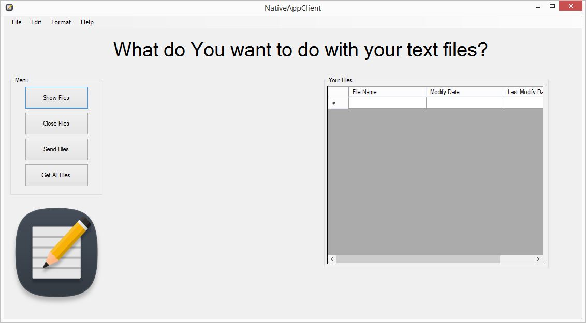
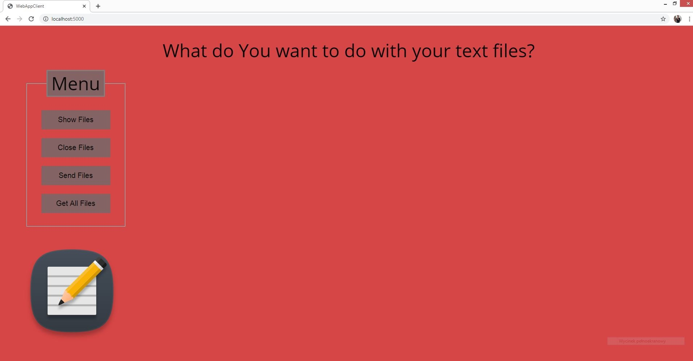

# Text Editor Application

## Table of contents
* [General Info](#general-info)
* [Screenshots](#screenshots)
* [Technologies](#technologies)
* [Features](#features)
* [Running Desktop Application](#running-desktop-application)
* [Library](#library)
* [Additional](#additional)
* [Native Application](#native-application-desktop-windows-forms)

## NativeAppClient


* utworzenie nowego pliku
* wyświetlenie pliku
* edycja pliku
* wysłanie zedytowanych plików na serwer
* pobranie listy plików z serwera
* komunikacja z serwerem odbywa się za pomocą REST API

## WebAppClient

* Running Web Application:
```sh

```
* Web App runs on
http://localhost:3000/ || http://127.0.0.1:3000

## Server Node.js Web Server
<p align="center"></p>
<p align="center"></p>


* Node.js Web Server - https://nodejs.org/en/docs/guides/getting-started-guide/
* Running Node.js Web Server:
```sh
node app.js
```
* Node.js HTTP Module - https://www.w3schools.com/nodejs/nodejs_http.asp

* mongoose - https://mongoosejs.com/ || https://github.com/Automattic/mongoose || https://www.npmjs.com/package/mongoose
* Install mongoose:
```sh
npm install mongoose
```
* Install body-parser
```sh
npm install body-parser
```
* Server runs on
http://localhost:5000/
current url: http://localhost:5000/orders

* Info
127.0.0.1:5000 = localhost:5000

## Database MongoDB
<p align="center"></p>

<p align="center"></p>


* MongoDB Official - https://www.mongodb.com/ | https://www.npmjs.com/package/mongodb
* Mongo Help - https://zellwk.com/blog/local-mongodb/ | http://jsdn.pl/podstawy-mongodb/
* MongoDB Compass - https://www.mongodb.com/download-center/compass
* MongoDB Documentation - https://docs.mongodb.com/manual/reference/method/db.collection.insert/#examples
* Install MongoDB:
```sh
npm install mongodb
```
* Check version:
```sh
mongo -version
```
* Running Databse Server:
```sh
mongod --dbpath .
```
* Running Process Database - Interaction with MongoDB:
```sh
mongo
```
* Running MongoDB Compass:
```sh
C:\Program Files\MongoDB Compass\MongoDBCompass.exe
```
* To connect to your local MongoDB:
```sh
Hostname: localhost
Port: 27017
URL: mongodb://127.0.0.1:27017
```

* Commands:
```sh
db
```
```sh
show dbs
```
```sh
use <database>
```
```sh
db.<collectionName>.insert({name: "Paul"})
```
```sh
db.<collectionName>.insert({name: 'Mark'})
```
```sh
db.<collectionName>.insertOne({ name: "Jax" })
```
```sh
db.<collectionName>.insertOne({ name: 'Jon Snow' })
```
```sh
db.<collectionName>.find()
```
```sh
db.<collectionName>.drop()
```
```sh
show tables 
```
```sh
show collections
```

## REST Application Programming Interface
* https://www.youtube.com/watch?v=V0zaBuHkzOY&ab_channel=Jakzacz%C4%85%C4%87programowa%C4%87%3F
* https://www.youtube.com/watch?v=P9b8-BrWdYs&ab_channel=overment
* https://devszczepaniak.pl/projektowanie-rest-api/
* https://www.youtube.com/watch?v=XdtbRkN97go&ab_channel=PrzemekBykowski
* https://www.youtube.com/watch?v=IbpvUNE1E6s&ab_channel=TechnikaProgramowania
* https://devszczepaniak.pl/projektowanie-rest-api/
* Testowanie REST API: https://www.udemy.com/share/101S863@4710_rkT2vfHfwmBe_Uqb-xvIhqDgS8OFw6txn-MO536Sdvwo_bTtFHBiHhlyugb/

## WebSocket/Socket.io
<p align="center"></p>

* Install WebSocket/Socket.io:
```sh
npm install ws
```
* https://www.websocket.org/echo.html
* https://www.npmjs.com/package/ws
* WebSocket Demos: https://codepen.io/matt-west/pen/tHlBb
* Documentation socket.io: https://socket.io/docs/
* WebSocket Wideo: https://www.youtube.com/watch?v=13HnJPstnDM&ab_channel=AhmedSchrute
* WebSocket Wideo: https://www.youtube.com/watch?v=TjfFPMCPBVg&ab_channel=ParametricCamp
* WebSocket Wideo: https://www.youtube.com/watch?v=8ARodQ4Wlf4&ab_channel=freeCodeCamp.org
* WebSocket Wideo: https://www.youtube.com/watch?v=ThiAQAB5Dp4&ab_channel=ParametricCamp
* WebSocket Wideo: https://www.youtube.com/watch?v=xgLRe7QV6QI&ab_channel=Brian
* WebSocket Wideo: https://www.youtube.com/watch?v=Rctz-kCvuwE&ab_channel=MiguelGrinberg
* WebSocket Wideo: https://www.youtube.com/watch?v=zWax5QCWCXM
* WebSocket Wideo: https://www.youtube.com/watch?v=RL_E56NPSN0&ab_channel=KarlHadwen
* WebSocket Wideo: https://www.youtube.com/watch?v=PVXHFJlntAU&ab_channel=LeonWatson
* WebSocket Wideo: https://www.youtube.com/watch?v=ZKEqqIO7n-k&ab_channel=WebDevSimplified
* WebSocket Wideo: https://www.youtube.com/watch?v=jD7FnbI76Hg&ab_channel=TraversyMedia
* WebSocket Wideo: https://www.youtube.com/watch?v=e17Lv35Tm-8&ab_channel=SpicySpices
* WebSocket Wideo: https://www.youtube.com/watch?v=ZKEqqIO7n-k&ab_channel=WebDevSimplified
* WebSocket Wideo: https://www.youtube.com/watch?v=zQDzNNt6xd4&ab_channel=SandeepSudhakaran
* WebSocket Wideo: https://www.youtube.com/watch?v=SVkuliabq4g&ab_channel=Stevdza-San
* VCS Wideo: https://www.youtube.com/watch?v=i2eQ6rrUBK8&ab_channel=Stevdza-San
* VCS Wideo: https://www.youtube.com/watch?v=SVkuliabq4g&ab_channel=Stevdza-San
* VCS Wideo: https://www.youtube.com/watch?v=D9kHCecCN9w&ab_channel=Stevdza-San
* Chat: https://github.com/coderoadpl/chat-app-in-30-minutes || https://www.youtube.com/watch?v=_HFlJ3Z6YJM&ab_channel=CodeRoad-KursJavaScriptOnline || https://www.youtube.com/watch?v=NU-HfZY3ATQ

## Additional
* .NET components:
  * MenuStrip
  * SaveFileDialog
  * OpenFileDialog
  * Button
  * GroupBox
  * PictureBox
  * RichTextBox
  * DataGridView
  
## To Collaborate

1. git clone https://github.com/wojcikpawel/TextEditorRepository.git
2. git checkout -b <your_initials + branch_number>  //for example:  git checkout -b mp_1
2.1 "make changes in your local repository"
3. git add <path_files>
4. git commit -m "#<number> Your comment"               //for example: git commit -m "#1 Adding new label in NoticeView"
5. git push origin <branch_number>                             //for example: git push origin mp_1
6. git checkout master

You should log in and pull request from your WWW repository

for pull changes from master repository:
1. git checkout master
2. git fetch
3. git pull

for invite your collaborator:
1. Settings
2. Manage Access
3. Invite a collaborator

## Summary
Paweł Wójcik &copy;


This application was created by **Paweł Wójcik** <br />
> **Google Play:** https://www.google.pl/ <br />
> **Apple Store:** https://www.google.pl/ <br />
> **Expo:** https://www.google.pl/ <br />

Proof of concept

MVP - Minimum Viable Product

DEMO

JAMStack:
* JavaScript
* API
* Markup
 
MERNStack:
* MongoDB
* Express.js
* React.js
* Node.js

## Real Time Chat App with ReactJS and Socket.io - #1 - #7
* https://www.youtube.com/playlist?list=PLfUtdEcvGHFHdOYFXj4cY6ZIFkSp6MOuY
* https://www.youtube.com/watch?v=vu2gxHGgWIs || https://github.com/lyraddigital/chat-app-react

## Building a chat app with Socket.io and React 🚀
* https://dev.to/novu/building-a-chat-app-with-socketio-and-react-2edj
 
## Notification management simplified - The ultimate service for managing multi-channel notifications with a single API.
* https://github.com/novuhq/novu

## Logowanie/Meldowanie (ang. Logging In/Sign In)
* https://www.youtube.com/watch?v=reumU4CvruA&ab_channel=WebDevSimplified
* https://www.youtube.com/watch?v=X9reTI_Mckk&ab_channel=ParvatComputerTechnology

## Rejestracja/ (ang. Registration/Sign Up)
* https://www.youtube.com/watch?v=Nc5AIJJ2ARA&ab_channel=ParvatComputerTechnology

## MagicEraser - Usuń niechciane elementy z obrazków w kilka sekund!
* https://www.magiceraser.io/
 
## Grafika Komputerowa
* https://pl.aiseesoft.com/
 
## JSON
* https://jsoncrack.com/
* JWT - JSON Web Tokens: https://jwt.io/

## HTML&CSS
* https://webkod.pl/kurs-css/wlasciwosci/uklad-elastyczny/flex-direction
* https://www.kurshtml.edu.pl/css/przeplyw,elastyczne.html
* https://ui2web.com/frontend/jednostki-viewport-na-czym-polegaja/
* https://how2html.pl/link-html/

## Autodraw
* https://www.autodraw.com/
